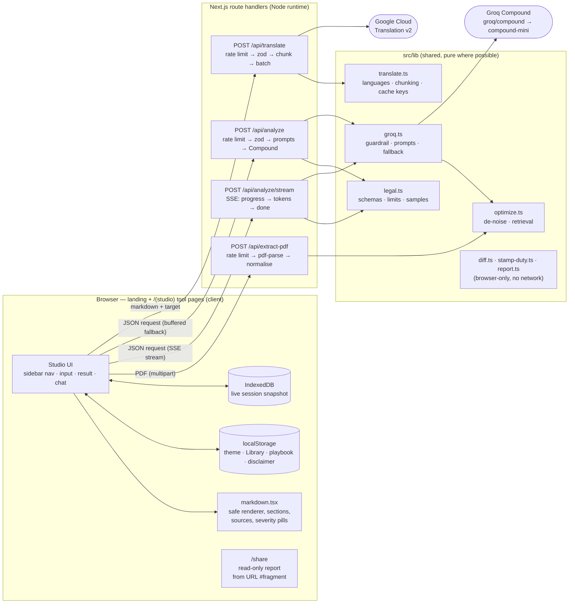

# LexClarity — AI Legal Information Studio for India

GenAI-powered legal information assistant that makes Indian legal documents
understandable: simplify contracts into plain language, X-ray risks, check them
against your own clause playbook, redline two versions word by word, answer
questions grounded in your documents and current Indian law, estimate stamp duty,
and hand the matter to an advocate with a one-click brief.

Built for the **AI for Legal Assistance & Access** hackathon.

> **Information only — not legal advice.** LexClarity explains Indian law as a
> starting point and helps you prepare for a professional. Always consult an
> advocate enrolled with the Bar Council of India before acting. Eligible
> citizens can seek free legal aid via NALSA / DLSA (toll-free 15100).

## Features

Each tool is its own page (`/simplify`, `/risks`, …) with a shared sidebar;
your document, location and language follow you between pages.

| Tool | What it does |
| --- | ------------ |
| ✨ Simplify | TL;DR, plain-language breakdown, key numbers table, India-specific implications (stamp duty, TDS/GST, CPA 2019, DPDP Act 2023), jargon buster |
| 🛡️ Risk X-Ray | 0–100 risk score, High/Medium/Low clauses with fix wording, missing protections an Indian advocate would add |
| 📋 Playbook | Your standard positions (e.g. "liability must be mutual and capped") checked against any document: Meets / Partial / Fails / Not addressed per position, deal-breakers, paste-ready redline requests. Playbook saved in the browser |
| ⚖️ Compare | Side-by-side table (payment incl. TDS/GST, IP, non-compete with s.27 Contract Act call-out, arbitration vs courts), verdict on which to sign — plus an instant **word-level Redline** view (inline insertions/deletions, "changes only" mode, copy/.md/PDF) computed in the browser with no AI call |
| 💬 Ask | Q&A grounded in your document + chat history, with one-click preset questions (e-Daakhil, non-compete, 11-month registration…) |
| ✅ Action Plan | Obligation checklists, deadlines, evidence to preserve (UTRs, GST invoices, registered copies), India remedies roadmap |
| 💼 Advocate Brief | One-click PDF handoff packet (matter summary, timeline, key terms, risks, legal issues, evidence checklist, sharp questions) plus find-an-advocate by practice area and city (NALSA/DLSA, Tele-Law, Nyaya Bandhu, Bar Council verification) |
| 🧾 Stamp Duty | Offline state-wise stamp duty + registration fee estimate (Maharashtra Art. 36A leave & licence, sale deeds in MH/DL/KA/TN/GJ/WB/UP), compulsory-registration rule, e-registration steps with official portal, and a live web-verified check of current rates |

- **Grounded in current Indian law** via Groq Compound's agentic web search
  (Contract Act 1872, CPA 2019, DPDP Act 2023, Arbitration & Conciliation Act
  1996, BNS/BNSS 2023, state Stamp Acts, e-Daakhil, NALSA…)
- **Live streaming responses** — every tool streams Server-Sent Events from
  `POST /api/analyze/stream` (`progress` → `token` → `done`), so the first
  words render in ~1s instead of after the full ~25s Compound run. Agent
  progress labels ("Reading… → Verifying against live sources… →
  Drafting…") show what's happening; if the stream drops mid-flight the app
  falls back to the buffered `POST /api/analyze` automatically
- **State/city autocomplete** covering all states, UTs, and major cities
- **Professional light/dark themes** (persisted toggle in the navbar, respects
  OS preference, navy + gold in both modes)
- **Three reading levels** (Plain / Standard / Detailed), file upload
  (`.txt` / `.md` / `.pdf` / `.docx` — PDFs are text-extracted server-side, up
  to 12 MB and 40 pages; `.docx` via mammoth with the same 12 MB cap),
  one-click Indian sample documents, drag-and-drop upload, and an Export menu
  (copy, `.md`, Save as PDF)
- **Saved library + shareable reports** — every analysis is saved in the
  browser (search, pin, rename, download, delete); *Export → Full report*
  combines every tool run on a document; *Copy read-only link* shares the report
  via a compressed URL fragment (`/share#r=…`) that never reaches the server
- **Session restore** — your live session (document, results, Ask chat thread,
  settings) is snapshotted to IndexedDB and restored after a refresh, with a
  *Start fresh* option. Uploaded-file cards can't be restored (browsers don't
  let pages re-read files), so re-drop the PDF if you see one missing
- **Per-visitor rate limits** — `POST /api/analyze` allows 5 analyses/minute
  and 30/hour per IP (translate and PDF-extract have their own budgets; see
  `src/lib/rate-limit.ts`). Over-limit callers get a `429` with `Retry-After`
  and a working Retry button; callers spending their own `apiKey` are exempt
- **Multilingual output** — every result and chat reply can be translated into
  9 Indian languages (Hindi, Marathi, Tamil, Telugu, Bengali, Gujarati,
  Kannada, Malayalam, Punjabi) via Google Cloud Translation, with cached
  translations and a show-original toggle

## Tech stack

- **pnpm** · **Next.js 16** (App Router) · **TypeScript 5** (strict:
  `noUncheckedIndexedAccess`, `exactOptionalPropertyTypes`,
  `verbatimModuleSyntax`, zero `any`) · **Tailwind CSS 4**
- **Groq Compound** (`groq/compound`, fallback `groq/compound-mini`) via
  `groq-sdk` — agentic web search + visit-website + code execution
- **Google Cloud Translation v2** (server-side) for regional-language output
- Request validation with `zod` (discriminated union over the 8 actions)
- **Full test suite: 180 tests, 22 files** — Vitest + Testing Library, see
  [Testing](#testing)

## Testing

```bash
pnpm test             # run once (CI mode)
pnpm test:watch       # watch mode while developing
pnpm test:coverage    # with V8 coverage report (text + html)
```

No network calls: the Groq SDK and `pdf-parse` are mocked, so the suite runs
offline in ~2 seconds. What's covered:

| File | Tests |
| ---- | ----- |
| `src/lib/legal.test.ts` | All 5 zod request schemas (valid/invalid), union routing, `truncate`, sample-doc integrity |
| `src/lib/optimize.test.ts` | Token estimates, PDF de-noising (page markers, repeated headers), keyword retrieval (order, fallback, empty docs) |
| `src/lib/groq.test.ts` | API-key resolution, Compound success/usage/grounding detection, `compound-mini` fallback, per-action token caps, excerpt prompts, India guardrail, streaming deltas/grounding/fallback via `runCompoundStream` |
| `src/app/api/analyze/route.test.ts` | Non-JSON/short-doc 400s, missing-key 401, success payload, upstream 502, invalid-key 401 mapping, 429 past budget, BYOK bypass |
| `src/app/api/analyze/stream/route.test.ts` | Invalid-payload 400, missing-key 401, `progress`/`token`/`done` SSE sequence, `error` event on upstream failure |
| `src/app/api/extract-pdf/route.test.ts` | Missing/non-PDF/empty/oversize rejections, scanned-PDF 422, normalised-text success, parser-crash 422, 429 past budget, `.docx` success (null pages) / empty / oversize / crash, legacy `.doc` 415 |
| `src/components/theme-*.test.tsx` | Provider defaults, stored preference, missing-provider error, toggle + persistence |
| `src/app/page.test.tsx` | Landing hero + tool links, sidebar nav, disclaimer/tour, per-tool validation/sample/export/Retry, severity/sources/jump-to, Ask send/rollback/suggestions, `.txt`/`.pdf` upload, redline, playbook rules, stamp estimate+verify, handoff brief, share link, Library save/reopen (fetch stub serves SSE on `/api/analyze/stream`, JSON on `/api/analyze`) |
| `src/lib/translate.test.ts` | Hash/cache keys, paragraph chunking, entity decoding, target allow-list, 10-language coverage |
| `src/components/markdown.test.tsx` | HTML escaping, safe links, severity detection, section and source extraction |
| `src/lib/recent.test.ts` | Recent list order/cap/dedupe, corrupt storage, titles, disclaimer consent |
| `src/lib/diff.test.ts` | Myers edit script + cap, tokenizer (amounts/decimals), inline word changes, re-wrapped lines, reconstruction, 600-clause performance, changes-only collapse |
| `src/lib/stamp-duty.test.ts` | MH Art. 36A (notional interest, ₹100 rounding/minimum, rural fee), sale-deed rates and concessions, registration cap, state lookup, portal links |
| `src/lib/report.test.ts` | Full-report ordering/nesting, compressed share-link round-trip (Indic text), tampered tokens, file names |
| `src/lib/playbook.test.ts` | Playbook defaults/persistence/corruption, active rules, advocate-finder links and city parsing |
| `src/components/studio/workspace-restore.test.tsx` | Fresh start with empty store, full session restore (doc, results, chat), Start-fresh wipe |
| `src/components/shared-report.test.tsx` | Read-only share page render, broken-link message |
| `src/app/api/translate/route.test.ts` | Bad-payload 400s, missing-key 401, oversize 413, translated+decoded success, chunked batching, upstream 502s, 429 past budget |
| `src/lib/rate-limit.test.ts` | Sliding-window allow/deny/expiry, tightest-of-rules, per-key isolation, reset, IP extraction, 429 phrasing, live budget label |
| `src/lib/session-store.test.ts` | IndexedDB round-trip, empty-store null, clear, malformed-snapshot rejection, emptiness detection |

Current coverage: API routes ~100%, `groq.ts` ~92%, `optimize.ts` ~95%,
`page.tsx` ~63%.

## Getting started

Prerequisites: Node 22+, pnpm 10+.

```bash
pnpm install
cp .env.example .env.local   # then put your key in .env.local
pnpm dev                     # open http://localhost:3000
```

Environment:

```bash
# .env.local
GROQ_API_KEY=gsk_...
GOOGLE_TRANSLATE_API_KEY=AIza...
```

Production check:

```bash
pnpm build
pnpm start
```

## Architecture

LexClarity is a single Next.js app. The browser handles the UI and all
per-user state. Four server-side route handlers are the only code that talks
to third-party services, so API keys never reach the browser. There is no
database: documents pass through the server in memory and aren't kept, and
per-IP sliding-window rate limits (`src/lib/rate-limit.ts`) protect the paid
APIs from abuse.



### Request flow

1. **Get the document text.** Pasted text goes straight into state. A `.txt`
   file is read in the browser. A PDF goes to `/api/extract-pdf`, where
   `pdf-parse` extracts up to 40 pages. `normalizeExtractedText` then strips
   page markers and repeated headers and footers, and the text comes back for
   the user to review.
2. **Run the analysis.** The page builds a payload for the active tab and posts
   it to `/api/analyze/stream`:
   - `AnalyzeRequestSchema` (a zod union keyed on `action`) validates it.
   - `buildMessages` pairs the India-first guardrail with that action's output
     format, reading level and location hint.
   - For long documents in Ask, `retrieveRelevant` sends only the most
     relevant excerpts.
   - `runCompoundStream` calls `groq/compound` with `stream: true` (output-token
     limit per action, `groq/compound-mini` fallback) and forwards each content
     delta as an SSE `token` event, with `progress` events for agent status
     (reading → verifying against live sources → drafting) and a final `done`
     event carrying the full `{ action, markdown, model, grounded }`.
   - The client renders tokens as they arrive and finalises on `done`. If the
     stream drops mid-flight, it retries once against the buffered
     `POST /api/analyze`, which runs the same validation and `runCompound`
     (non-streaming) and returns the full payload as JSON.
3. **Render.** The response `{ action, markdown, model, grounded }` is stored
   per tool:
   - `renderMarkdown` escapes all HTML, then builds headings (with anchors for
     *Jump to*), tables, severity pills and safe `https` links.
   - `extractSources` collects cited links into the Sources list.
   - The result is also saved to **Recent** in `localStorage`.
4. **Translate (optional).** If the output language isn't English, the
   markdown goes to `/api/translate`. It's split by paragraph, sent to Google
   in one batch, HTML entities are decoded, and the result is cached in memory
   by content hash plus language. "Show English" switches back without a new
   request.
5. **Export.** *Copy* and *.md* use the text currently on screen. *Save as PDF*
   prints the rendered result through a hidden iframe. This uses the browser's
   own text layout, so Devanagari and other Indic scripts render correctly
   without bundling fonts.

### Design decisions

| Decision | Why |
| --- | --- |
| Server-only API calls | `GROQ_API_KEY` / `GOOGLE_TRANSLATE_API_KEY` stay on the server; the browser only calls same-origin routes |
| zod at every boundary | Request bodies, the Google response, and client-side response checks all validate data shapes, so bad data fails with a clear 4xx instead of breaking later |
| Markdown as the result format | One format works for display, translation, copy, `.md` export and printing. The renderer escapes everything before adding its own tags |
| Fallback model | `groq/compound-mini` keeps the app working when the main model errors or returns nothing |
| No database | Nothing sensitive is stored on the server. The saved library lives in the user's localStorage and the live session in their IndexedDB — both stay on-device |
| Rate limits at the route, not the client | A server-side sliding-window limiter caps paid-API spend per IP; the UI shows the budget and honours `Retry-After`, so limits can't be bypassed by editing client code. Both `/api/analyze` and `/api/analyze/stream` share the same budget |
| Streaming-first with buffered fallback | Tokens render as they arrive for <1s perceived latency; a mid-stream failure retries once against the non-streaming endpoint instead of showing an error |
| Cost controls in `lib/` | De-noising, retrieval and output limits are pure functions with unit tests, separate from HTTP handling (see [Cost optimisation](#cost-optimisation-less-llm-spend-per-analysis)) |
| Translation triggered by user actions, not effects | It starts from event handlers (run finished, language changed) with a request id, so a slow old translation can't overwrite a newer one |

### Project structure

```text
src/
  app/
    page.tsx                    # Landing: hero, tool cards, FAQ, CTAs
    page.test.tsx               # Landing + studio integration tests
    (studio)/                   # Tool pages sharing WorkspaceProvider + sidebar
      layout.tsx                # Studio shell (nav, settings, Library, tour)
      simplify|risks|playbook|compare|ask|action|handoff|stamp/page.tsx
    layout.tsx                  # Metadata, viewport, fonts, theme boot script
    globals.css                 # Tailwind 4 tokens (light/dark), typography, mobile safe-areas
    icon.svg                    # Favicon (scales of justice)
    api/
      analyze/route.ts          # POST /api/analyze — rate limit → validate → Groq Compound
      analyze/stream/route.ts   # POST /api/analyze/stream — same, but SSE (progress → tokens → done)
      extract-pdf/route.ts      # POST /api/extract-pdf — rate limit → PDF/.docx → cleaned text
      translate/route.ts        # POST /api/translate — rate limit → Google Cloud Translation
    share/page.tsx              # /share#r=… — read-only shared report
    docs/page.tsx               # /docs — guides, limits (incl. fair use), FAQ
  components/
    studio/                     # workspace.tsx (shared state + session restore),
                                # studio-shell.tsx, tool-page.tsx, chat-panel.tsx,
                                # panels.tsx (input/result), tools.tsx (nav metadata)
    markdown.tsx                # Safe markdown renderer, sections, sources, severity
    export-menu.tsx             # Copy / .md / PDF / full report / share link menu
    redline.tsx                 # Word-level track-changes view for Compare
    playbook-editor.tsx         # Edit standard positions
    stamp-duty-panel.tsx        # State-wise duty calculator + e-registration steps
    advocate-finder.tsx         # Practice area + city → directories & legal aid
    library-panel.tsx           # Saved analyses: search, pin, rename, share, delete
    shared-report.tsx           # Read-only report viewer for /share
    icons.tsx, logo-mark.tsx    # Line icon set + brand mark
    theme-provider.tsx, theme-toggle.tsx
    use-dismiss.ts              # Outside-click / Escape handling for popovers
  lib/
    legal.ts                    # zod schemas, types, limits, Indian sample documents
    groq.ts                     # Compound client, India guardrail, per-action prompts
    optimize.ts                 # PDF de-noising, token estimates, keyword retrieval
    translate.ts                # Language list, chunking, cache keys, client helper
    recent.ts                   # localStorage: saved library (pin/rename/search) + consent
    rate-limit.ts               # Per-IP sliding-window limits + Retry-After messages
    session-store.ts            # IndexedDB: live-session snapshot persistence
    diff.ts                     # Two-pass Myers word-level redline
    playbook.ts                 # Default positions + persistence
    stamp-duty.ts               # State rate rules, Art. 36A, e-registration steps
    advocate.ts                 # Practice areas + official directory links
    report.ts                   # Full report markdown + share-link encoding
datasets/
  README.md                     # Real bare-Act PDFs (India Code, e-Gazette, MeitY…)
                                # for demoing each feature + suggested demo flows
```

### API

`POST /api/analyze` accepts a discriminated-union JSON body:

```json
{ "action": "simplify", "document": "...", "readingLevel": "plain",
  "jurisdiction": "Pune, Maharashtra" }
```

Actions: `simplify` · `risks` · `compare` (`documentA`/`documentB`) · `ask`
(`question` + optional `document`/`history`) · `action` (optional `goal`) ·
`playbook` (`rules`: 1–20 positions) · `handoff` (optional `situation`,
`specialty`) · `stamp` (`state`, `instrument`: `rent`|`sale`, `details` with the
offline estimate to verify).
Responds with `{ action, markdown, model, grounded }`.

`POST /api/analyze/stream` accepts the same body and returns
`text/event-stream` instead of JSON:

```text
event: progress
data: {"phase":"reading","label":"Reading your document…"}

event: token
data: {"token":"## TL;DR\n"}

event: progress
data: {"phase":"drafting","label":"Drafting your answer…"}

event: done
data: {"action":"simplify","markdown":"## TL;DR\n…","model":"groq/compound","grounded":false}
```

Failures mid-stream arrive as `event: error` with
`{"error": "…", "status": 502}`. Validation, rate-limit and missing-key
rejections happen before the stream starts and use the same plain-JSON
`4xx` responses as `/api/analyze`, so the client can surface them directly.

`POST /api/translate` translates English analysis output into an Indian
language via Google Cloud Translation (key stays server-side):

```json
{ "texts": ["The deposit is refundable within 30 days."], "target": "hi" }
```

Accepts up to 10 texts (15k chars each, 30k total); long texts are
paragraph-chunked into a single batched request. Responds with
`{ translations: [...] }` with HTML entities decoded.

## Cost optimisation (less LLM spend per analysis)

Output tokens cost ~4× input tokens on Compound, and each web-tool call is
billed per request — so the app minimises all three (`src/lib/optimize.ts`,
`src/lib/groq.ts`):

1. **De-noise PDFs at extraction** — page markers (`-- 3 of 12 --`), repeated
   running headers/footers, and collapsed whitespace are stripped in
   `/api/extract-pdf` before anything reaches the model (~10–30% fewer input
   tokens on multi-page PDFs, zero information loss).
2. **Retrieval for Q&A** — questions over documents longer than ~8k characters
   send only the most relevant excerpts (keyword-ranked, order-preserved,
   12k-char budget) instead of the whole file. Follow-up questions stay cheap.
3. **Per-action output budgets** — `ask` gets 1,800 max tokens, `simplify`
   2,500, `risks`/`compare` 3,500 (previously a flat 4,096 everywhere).
4. **Tool-use discipline** — the system prompt forbids Compound web/code tool
   calls for pure summarisation; tools fire only when current external facts
   are genuinely needed (saves $5/1k searches).
5. **Visibility** — every call logs
   `[analyze] action=… prompt=… completion=… total=…` server-side, and the UI
   shows document length against the 60k-character limit before you hit Run.

Further levers (not yet enabled): response caching by document hash, routing
trivial summarisation to `groq/compound-mini` first, and `compound_custom`
with tools toggled per action.

## Roadmap — 10 features to make it richer

1. **Word-level redline diff** ✅ *shipped* — Compare → Redline shows inline
   insertions/deletions between two versions, computed in the browser.
2. **Clause playbook checks** ✅ *shipped* — user-defined standard positions
   auto-checked against any document in the Playbook tab.
3. **Multi-document Q&A** — chat across a whole corpus (all your agreements at
   once) with per-answer citations to the source document and clause.
4. **Deadline & obligation tracker** — extracted dates become reminders with
   `.ics`/Google Calendar export so nothing lapses.
5. **Hindi + regional languages** ✅ *shipped* — every result and chat reply
   translates into 9 Indian languages via Google Cloud Translation, with
   caching, batching, and a show-original toggle.
6. **Voice in / voice out** — speech-to-text questions and spoken answers for
   low-literacy and visually-impaired users.
7. **Stamp-duty calculator** ✅ *shipped* — state-wise duty + registration-fee
   estimate (Maharashtra Article 36A and sale deeds in 7 states) with
   e-registration guidance and live verification. Rates are indicative
   (reviewed September 2026) and must be confirmed on the state portal.
8. **Citation verifier** — every statute/section the AI cites gets live
   verification with links to India Code / eCourts / Indian Kanoon.
9. **Advocate handoff packet** ✅ *shipped* — one-click PDF brief plus
   find-an-advocate by specialty and city (official directories and free legal
   aid; no individual advocates are listed or ranked).
10. **Saved library + shareable reports** ✅ *shipped* — persistent browser
    library, full report export, and read-only share links carried in the URL
    fragment (no server storage).

## Demo script (2 minutes)

1. Upload `datasets/indian-contract-act-1872.pdf` (or load the **Contract**
   sample) → **Risk X-Ray** → Run. Point out the 12-month
   pan-India non-compete flagged under **s.27, Indian Contract Act 1872**.
2. Switch to **Compare**, load the rent agreement as Document B, paste any
   variant as A → Run for the side-by-side verdict table.
3. Ask tab → click the e-Daakhil preset → Run to show web-grounded answers
   with current Indian procedure.

## Deploy

Set `GROQ_API_KEY` in your host's environment variables (Vercel, etc.) and
deploy as a standard Next.js app. The key never ships to the browser — all
Groq calls run server-side in `/api/analyze`, behind per-IP rate limits
(5 analyses/min, 30/hour). The limiter is in-memory per instance: fine for a
single server, but point it at Redis/Upstash if you scale horizontally (see
the comment in `src/lib/rate-limit.ts`).
